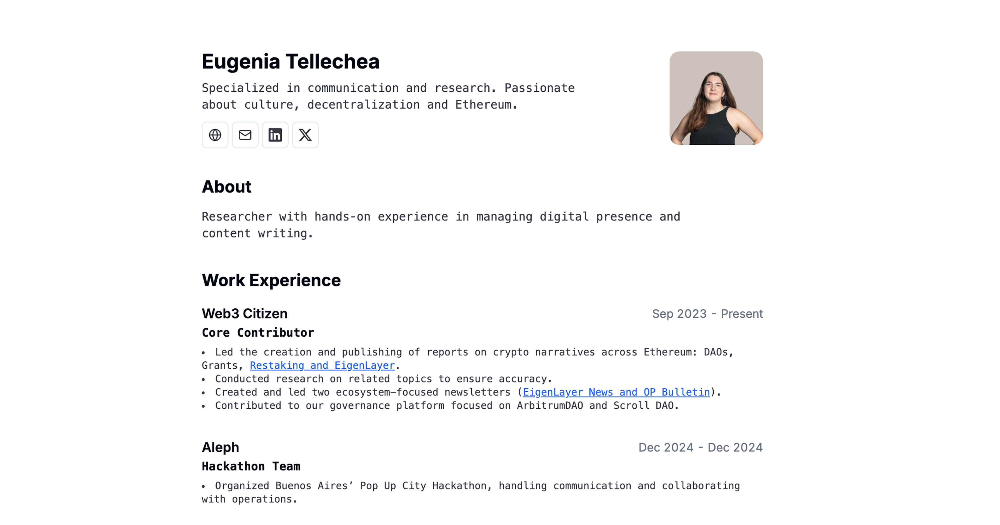

Eugenia's CV, a simple web app that renders minimalist CV with print-friendly layout.

Built with Next.js and shadcn/ui, deployed on Vercel.

# Features

- Built by forking Bartosz. Uses Next.js 14, React, Typescript, Shadcn/ui, TailwindCss
- Auto generated Layout
- Responsive for different devices
- Optimized for Next.js and Vercel

# License

[MIT](https://choosealicense.com/licenses/mit/)
